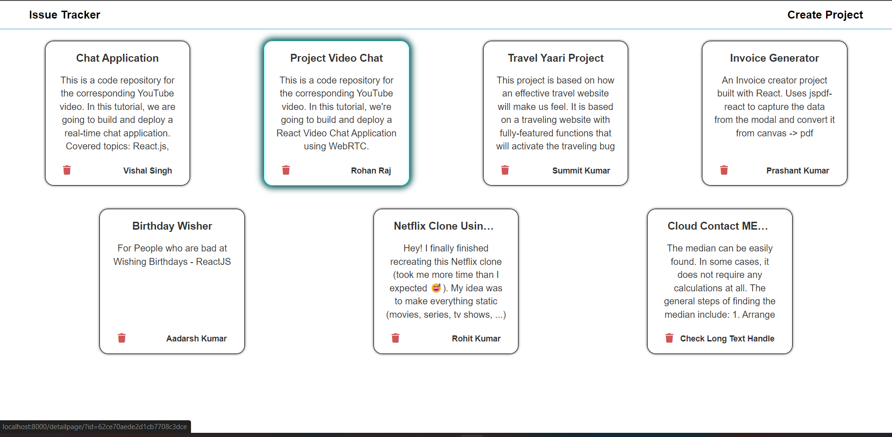
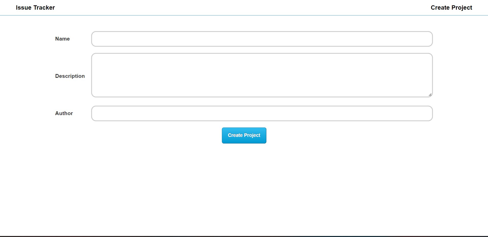
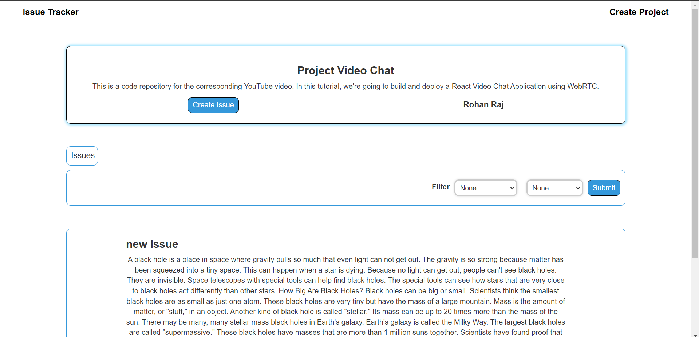
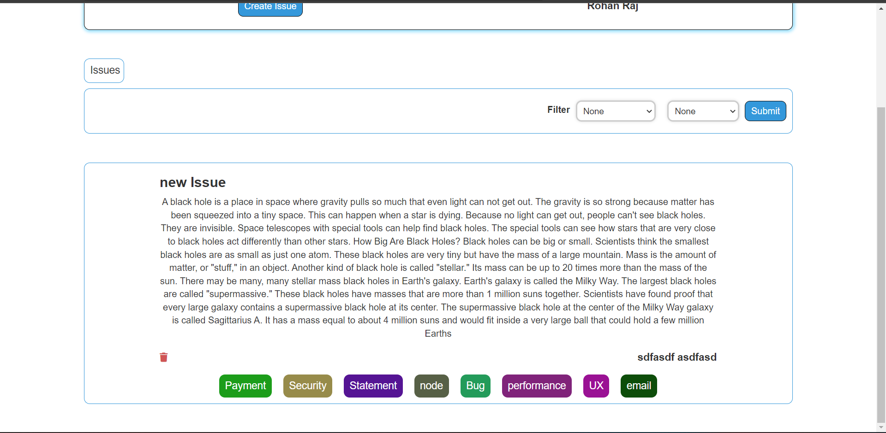
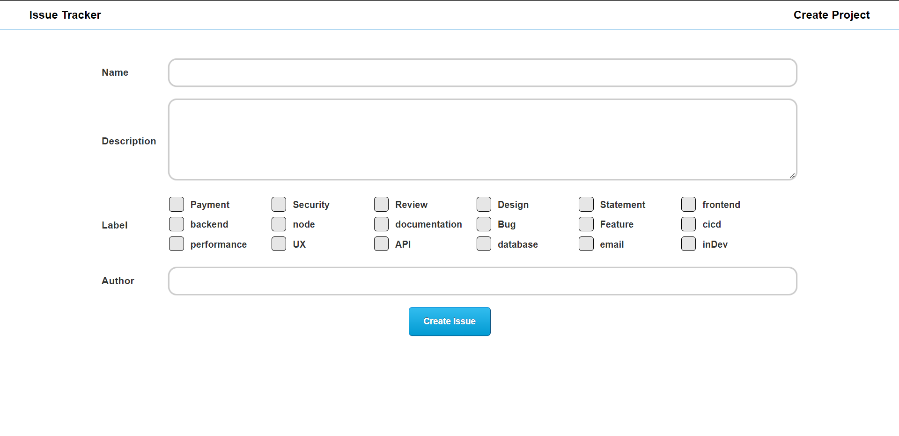

## Hosted Link -- https://project-issue-tracker178.herokuapp.com/

# Video

[](https://www.youtube.com/watch?v=uooPUnv1fes)

### Description

`Created a nodejs + ejs application to track issues/bugs for a project.`

in this project we can create a project with the name and description of the project, to track issue related to project,
we can see the issue of each project in the next page after clicking a specifics project, now on that project we can create new issue related to project. we can create project or issue and also delete it. there is also filter option to filter the issue based on label provided on each issue.

# ISSUE TRACKER

## Folder Structure

```
issue Tracker
├─ gulpfile.js
├─ index.js
├─ logs
├─ models
│  ├─ issue.js
│  └─ project.js
├─ package-lock.json
├─ package.json
├─ public
│  ├─ assets
│  │  ├─ css
│  │  │  ├─ createProject-a3e5ade0d8.css
│  │  │  ├─ error-44674379a3.css
│  │  │  ├─ home-45b36246ce.css
│  │  │  ├─ navBar-31a3ebf1cc.css
│  │  │  ├─ projectDetail-2bef1e80e6.css
│  │  │  └─ style-f6d500cc09.css
│  │  ├─ js
│  │  │  └─ index-f414cae7e8.js
│  │  └─ rev-manifest.json
│  └─ rev-manifest.json
├─ README.md
├─ routes
│  └─ index.js
└─ views
   ├─ createIssue.ejs
   ├─ createProject.ejs
   ├─ errorPage.ejs
   ├─ header.ejs
   ├─ home.ejs
   ├─ layout.ejs
   └─ projectDetail.ejs

```

## Some ScreenShots of Project






